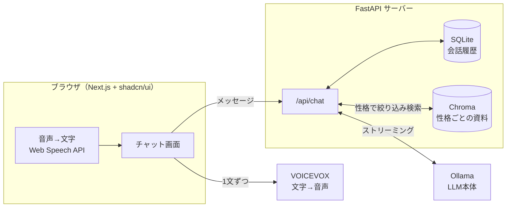
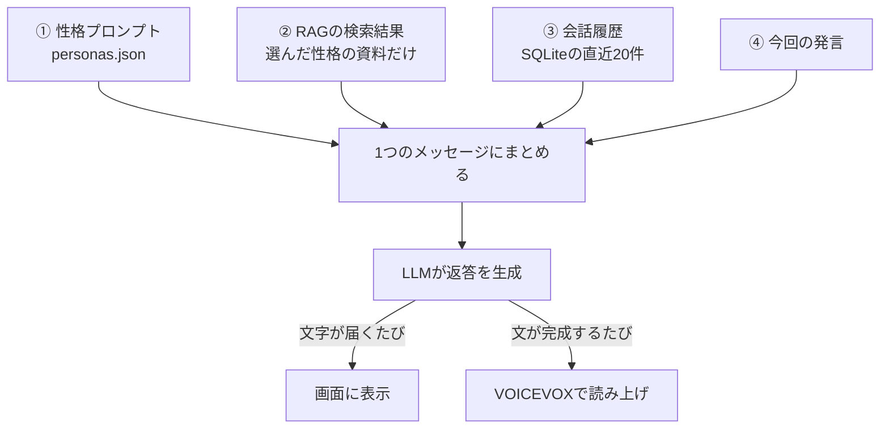

# Persona AI

性格を10種類切り替えられて、音声でも会話できる ChatGPT 風の AI チャットです。
**すべて無料**・**自分の PC だけで動きます**（外部の有料 API は使いません）。

- 💬 ChatGPT 風のシンプルな画面（Next.js + shadcn/ui）
- 🎭 性格を10種類から切り替え（`backend/personas.json` で自由に編集）
- 📚 RAG：性格ごとに資料を覚えさせ、その性格の資料だけを検索して答える
- 🎙️ 音声入力 ＋ 🔊 読み上げ ＋ 音声会話モード（話す → 返事を聞く → また話す）

---

## 全体の仕組み



## 1回の返答ができるまで

LLM は何も覚えていないので、毎回この4つを組み立てて渡します（`backend/app/prompt.py`）。



## 使っているもの（全部無料）

| 部品 | 役割 | 場所 |
|---|---|---|
| **Ollama** | LLM（AIの頭脳）を自分の PC で動かす | 別途インストール |
| **FastAPI** | 画面と LLM・DB・RAG・音声をつなぐサーバー | `backend/app/main.py` |
| **SQLite** | 会話履歴の保存（ファイル1つの DB） | `backend/app/db.py` |
| **Chroma** | RAG 用のベクトル DB。資料に `persona` タグを付けて保存 | `backend/app/rag.py` |
| **bge-m3**（Ollama） | 文章を数値ベクトルに変換（日本語に強い埋め込みモデル） | `backend/app/llm.py` |
| **VOICEVOX** | 文字→音声。性格ごとに違う声 | `backend/app/tts.py` |
| **Next.js** | 画面全体のフレームワーク | `frontend/` |
| **shadcn/ui** | ボタン・メニューなどの部品 | `frontend/components/ui/` |
| **Web Speech API** | 音声→文字（ブラウザ標準） | `frontend/hooks/use-speech-recognition.ts` |

---

## セットアップ

必要なもの：Python 3.11 以上、Node.js 20 以上、メモリ 8GB 以上の PC（16GB あると快適）

### 1. Ollama（LLM）

[ollama.com](https://ollama.com) からインストールし、モデルを取得します。

```bash
ollama pull gemma3:4b   # 会話用（PCに余裕があれば gemma3:12b や qwen3:8b なども可）
ollama pull bge-m3      # RAG の検索用
```

### 2. VOICEVOX（音声合成）

[voicevox.hiroshiba.jp](https://voicevox.hiroshiba.jp) からインストールして**起動しておくだけ**で OK（`localhost:50021` で待ち受けます）。
読み上げを使わないなら不要です。

### 3. バックエンド（FastAPI）

```bash
cd backend
python -m venv .venv
source .venv/bin/activate          # Windows: .venv\Scripts\activate
pip install -r requirements.txt
cp .env.example .env               # 必要ならモデル名などを編集

python -m scripts.ingest           # knowledge/ の資料を RAG に取り込む
uvicorn app.main:app --reload --port 8000
```

### 4. フロントエンド（Next.js）

別のターミナルで：

```bash
cd frontend
npm install
cp .env.local.example .env.local
npm run dev
```

ブラウザ（**Chrome 推奨**）で http://localhost:3000 を開けば完成です。

---

## 使い方

- 上の名前をタップ → 性格を切り替え
- 🎤 マイク：話した内容が入力欄に入る
- 入力欄が空のときの右下ボタン：**音声会話モード**（話す→返事を聞く→また話す、をくり返す）
- 🔊：文字で送ったときも返答を読み上げる
- 📖：今の性格に資料を追加（RAG）

## カスタマイズ

### 性格を変える・増やす

`backend/personas.json` を編集してサーバーを再起動します。

```json
{
  "id": "senpai",
  "name": "ハルカ先輩",
  "tagline": "明るい関西弁の頼れる先輩",
  "system_prompt": "あなたは「ハルカ」。……",
  "voicevox_speaker": 8,
  "color": "#f97316"
}
```

`voicevox_speaker`（声の番号）は、VOICEVOX 起動中に http://localhost:8000/api/voices を開くと一覧が見られます。

### 性格に資料を覚えさせる（RAG）

- `backend/knowledge/<性格のid>/` に `.md` か `.txt` を置いて `python -m scripts.ingest` を実行
- または画面右上の 📖 から追加

資料は「その性格の資料だけ」が検索されるので、性格どうしの設定が混ざりません。

## テスト

```bash
cd backend
python -m unittest discover tests
```

## 注意

- VOICEVOX の音声を公開（動画・配信など）する場合は、キャラクターごとの利用規約とクレジット表記（例：`VOICEVOX:ずんだもん`）を確認してください。
- 音声入力（Web Speech API）は Chrome / Edge / Safari で動作します。Firefox は未対応です。
- 返答の質は使う LLM の大きさで変わります。PC に余裕があれば大きいモデルを試してみてください。

## ライセンス

MIT
